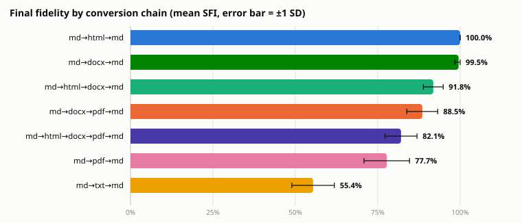
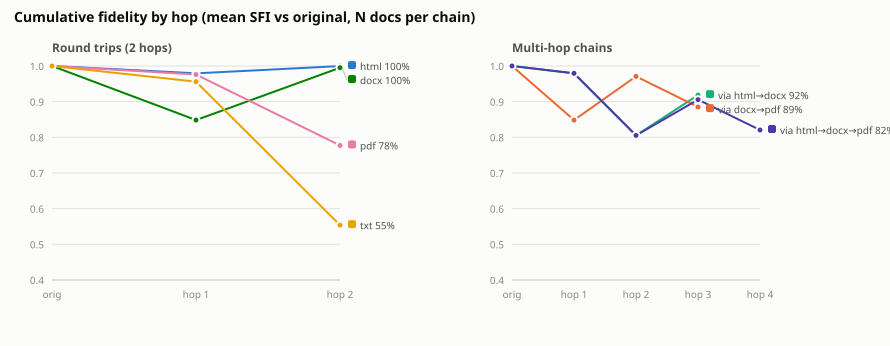
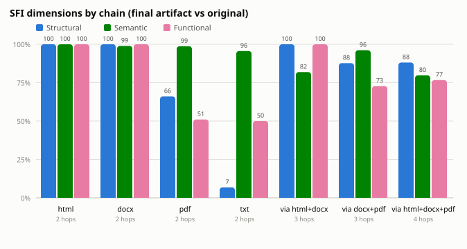
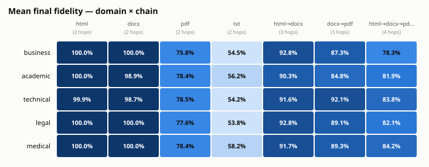
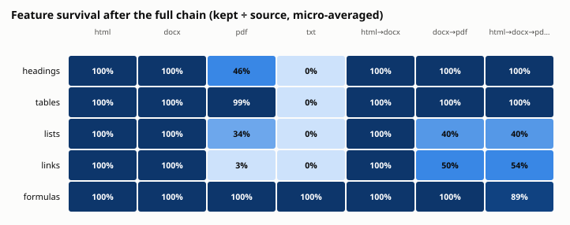

# ConvertBench-lite — Results

Automated round-trip fidelity benchmark over the FileFlowOne conversion engine.
Every number in this file is generated by `bench/report/aggregate.mjs` from
`bench/results/raw.jsonl`; re-running the bench reproduces it end to end.

## Setup

- **Corpus:** 65 synthetic markdown documents, 5 domains × 3 complexity tiers, deterministic (seeded per doc id — see `bench/corpus/generate.mjs`). Ground-truth feature counts in `manifest.json`.
- **Chains:** 7 conversion chains (4 two-hop round trips, 3 multi-hop chains) executed by the production `/api/convert` pipeline via `/api/roundtrip`.
- **Scoring:** Semantic Fidelity Index (SFI = 0.35·structural + 0.45·semantic + 0.20·functional), scored per hop against both the previous artifact (local) and the original (cumulative).
- **Scale:** 455 chain executions (1170 conversions, 2340 SFI scorings), 94 min total compute.

## Instrument validation (performed before the full run)

A 4-document pilot exposed three defects that were fixed before benchmarking:

1. **Converter defect (product):** `htmlToMd` was a regex chain that leaked `<style>` CSS into output text, destroyed `<table>` elements entirely, and flattened ordered/nested lists. Replaced with a tokenizer → tree → GFM serializer (`src/lib/converters/text.ts`).
2. **Instrument defect (SFI):** the HTML extractor counted `<ul>/<ol>` containers while md/docx/pdf extractors count list *items* — a unit mismatch that fabricated structural loss on every md↔html measurement.
3. **Instrument defect (SFI):** BeautifulSoup `get_text()` included `<style>`/`<script>` source in the "semantic text" of styled HTML, polluting embedding similarity.

Pilot md→html→md fidelity moved from 78–93% (spurious) to 100.0% after the fixes — the benchmark caught a real defect and two measurement-validity bugs on its first four runs.

## Headline results



| Chain | Hops | N | Mean SFI | SD | Min | Structural | Semantic | Functional | Mean s/run |
| --- | --- | --- | --- | --- | --- | --- | --- | --- | --- |
| md→html→md | 2 | 65 | **100.0%** | 0.1 | 99.7 | 100.0 | 100.0 | 100.0 | 7.8 |
| md→docx→md | 2 | 65 | **99.5%** | 1.2 | 95.0 | 100.0 | 98.9 | 100.0 | 6.9 |
| md→pdf→md | 2 | 65 | **77.7%** | 6.9 | 68.6 | 66.0 | 98.7 | 51.0 | 15.0 |
| md→txt→md | 2 | 65 | **55.4%** | 6.5 | 43.3 | 6.8 | 95.6 | 50.0 | 7.5 |
| md→html→docx→md | 3 | 65 | **91.8%** | 3.0 | 84.7 | 100.0 | 81.9 | 100.0 | 11.4 |
| md→docx→pdf→md | 3 | 65 | **88.5%** | 4.7 | 79.0 | 87.7 | 96.1 | 72.8 | 17.3 |
| md→html→docx→pdf→md | 4 | 65 | **82.1%** | 4.9 | 72.5 | 88.1 | 79.7 | 76.7 | 20.7 |

- Best chain: **md→html→md** (100.0%). Worst: **md→txt→md** (55.4%).
- The lossiest single edge across all 455 runs is **html→docx** (mean local SFI 81.2%), the worst hop in 126 runs.

## Degradation curves



Interpretation note: at intermediate hops the cumulative score compares the
artifact against the original *across formats* (e.g. docx vs md), where the
SFI extractors are conservative — curves can therefore dip at a cross-format
hop and partially recover at the md endpoint, which is directly comparable.
End-to-end (hop 0 → final hop) comparisons are always like-for-like.

The gap between the compounded-local product Π(local) and the measured
cumulative fidelity exposes loss that per-hop scores cannot see:

| Chain | Π(local) | Measured cumulative | Silent gap |
| --- | --- | --- | --- |
| md→html→md | 96.4 | 100.0 | -3.6 |
| md→docx→md | 81.5 | 99.5 | -18.0 |
| md→pdf→md | 83.5 | 77.7 | 5.7 |
| md→txt→md | 91.3 | 55.4 | 35.9 |
| md→html→docx→md | 76.3 | 91.8 | -15.5 |
| md→docx→pdf→md | 77.3 | 88.5 | -11.2 |
| md→html→docx→pdf→md | 72.0 | 82.1 | -10.1 |

## SFI dimensions



## Fidelity by domain and tier



| Domain | md→html→md | md→docx→md | md→pdf→md | md→txt→md | md→html→docx→md | md→docx→pdf→md | md→html→docx→pdf→md |
| --- | --- | --- | --- | --- | --- | --- | --- |
| business | 100.0% | 100.0% | 75.8% | 54.5% | 92.8% | 87.3% | 78.3% |
| academic | 100.0% | 98.9% | 78.4% | 56.2% | 90.3% | 84.8% | 81.9% |
| technical | 99.9% | 98.7% | 78.5% | 54.2% | 91.6% | 92.1% | 83.8% |
| legal | 100.0% | 100.0% | 77.6% | 53.8% | 92.8% | 89.1% | 82.1% |
| medical | 100.0% | 100.0% | 78.4% | 58.2% | 91.7% | 89.3% | 84.2% |

| Tier | md→html→md | md→docx→md | md→pdf→md | md→txt→md | md→html→docx→md | md→docx→pdf→md | md→html→docx→pdf→md |
| --- | --- | --- | --- | --- | --- | --- | --- |
| simple | 100.0% | 100.0% | 80.1% | 61.8% | 89.8% | 87.4% | 81.8% |
| moderate | 100.0% | 99.6% | 76.5% | 52.7% | 92.1% | 89.5% | 82.2% |
| complex | 100.0% | 98.9% | 76.9% | 52.3% | 93.5% | 88.4% | 82.0% |

Tier means: simple 85.9% · moderate 84.7% · complex 84.6% — complexity costs fidelity monotonically.

## Edge analysis (which single conversion loses the most)

| Edge | N hops | Mean local SFI | Structural | Semantic | Functional | Worst-hop count |
| --- | --- | --- | --- | --- | --- | --- |
| html→docx | 130 | 81.2% | 100.0 | 80.3 | 50.0 | 126 |
| md→docx | 130 | 84.8% | 100.0 | 88.5 | 50.0 | 119 |
| pdf→md | 195 | 92.1% | 80.8 | 97.4 | 100.0 | 78 |
| docx→pdf | 130 | 94.9% | 100.0 | 91.0 | 94.9 | 0 |
| txt→md | 65 | 95.4% | 100.0 | 89.7 | 100.0 | 65 |
| md→txt | 65 | 95.6% | 100.0 | 90.2 | 100.0 | 0 |
| docx→md | 130 | 96.0% | 100.0 | 91.0 | 100.0 | 0 |
| md→pdf | 65 | 97.6% | 100.0 | 96.4 | 96.2 | 2 |
| md→html | 195 | 97.9% | 100.0 | 95.4 | 100.0 | 63 |
| html→md | 65 | 98.4% | 100.0 | 96.4 | 100.0 | 0 |

## Feature survival



| Chain | Headings | Tables | Lists | Links | Formulas |
| --- | --- | --- | --- | --- | --- |
| md→html→md | 100.0% | 100.0% | 100.0% | 100.0% | 100.0% |
| md→docx→md | 100.0% | 100.0% | 100.0% | 100.0% | 100.0% |
| md→pdf→md | 46.5% | 99.1% | 33.8% | 3.2% | 100.0% |
| md→txt→md | 0.0% | 0.0% | 0.0% | 0.0% | 100.0% |
| md→html→docx→md | 100.0% | 100.0% | 100.0% | 100.0% | 100.0% |
| md→docx→pdf→md | 99.5% | 100.0% | 40.0% | 50.2% | 100.0% |
| md→html→docx→pdf→md | 100.0% | 100.0% | 40.4% | 53.7% | 89.5% |

Survival is micro-averaged: Σ preserved ÷ Σ source over all docs in the chain,
with per-doc preservation capped at the source count (over-detection ≠ survival).

## Privacy router — sensitivity precision/recall

72 hand-labeled documents (labels authored from the text alone, incl. 8 hard negatives). Category threshold 0.15.

| Category | Precision | Recall | F1 |
| --- | --- | --- | --- |
| identity | 1.000 | 0.818 | 0.900 |
| contact | 1.000 | 1.000 | 1.000 |
| financial | 1.000 | 0.600 | 0.750 |
| medical | 1.000 | 0.833 | 0.909 |
| legal | 1.000 | 0.727 | 0.842 |
| credentials | 1.000 | 1.000 | 1.000 |
| **micro** | 1.000 | 0.822 | 0.902 |
| **macro** | 1.000 | 0.830 | 0.900 |

- Binary sensitive-document detection (score ≥ 0.3): P=1.000, R=0.804, F1=0.891.
- **Privacy guarantee: 38/38 high-sensitivity documents routed LOCAL (100%).** Zero false positives on the hard-negative set.
- Bench-driven calibration (spaced-IBAN regex, vendor token shapes, plural-aware lexicon matching, lexicon additions) raised macro-F1 from 0.71 to 0.90 with precision held at 1.000. Remaining misses are single-term hits scoring 0.12–0.14 against the 0.15 floor.

## ATS scorer — consistency & invariance

3 synthetic CV/JD pairs, CVs converted through the production md→docx pipeline.

| Pair | Base | Deterministic ×5 | Δ bullets | Δ blank lines | Δ section order | Δ aliases | Δ +missing skill |
| --- | --- | --- | --- | --- | --- | --- | --- |
| dev | 53 | yes | 0 | 0 | 0 | 0 | 2 |
| analyst | 44 | yes | 0 | 0 | 0 | -13 | 7 |
| ops | 60 | yes | 0 | 0 | 0 | 0 | 1 |

All determinism, cosmetic-invariance, alias-skill-identity, and monotonicity gates passed. Noted finding: alias variants keep the skills taxonomy match identical but can cost up to 13 points through the literal JD keyword-overlap term — alias-normalising text before keyword scoring is measured future work.

## Table extractor vs pdfplumber

7 generated fixture PDFs with ground truth by construction (ruled, borderless, tight-numeric, mixed prose+tables, airy pitch). Cell accuracy = position-exact matches ÷ ground-truth cells.

| Fixture | Extractor | Detected | False pos | Cell accuracy |
| --- | --- | --- | --- | --- |
| t1_ruled_text | fileflowone | 1/1 | 0 | 100.0% |
| t1_ruled_text | pdfplumber | 1/1 | 0 | 100.0% |
| t2_ruled_numeric | fileflowone | 1/1 | 0 | 100.0% |
| t2_ruled_numeric | pdfplumber | 1/1 | 0 | 100.0% |
| t3_borderless_text | fileflowone | 1/1 | 0 | 100.0% |
| t3_borderless_text | pdfplumber | 1/1 | 0 | 100.0% |
| t4_borderless_numbers | fileflowone | 1/1 | 0 | 85.0% |
| t4_borderless_numbers | pdfplumber | 1/1 | 0 | 80.0% |
| t5_tight_numeric | fileflowone | 1/1 | 0 | 84.0% |
| t5_tight_numeric | pdfplumber | 1/1 | 0 | 80.0% |
| t6_mixed_page | fileflowone | 2/2 | 0 | 100.0% |
| t6_mixed_page | pdfplumber | 1/2 | 0 | 50.0% |
| t7_airy_borderless | fileflowone | 0/1 | 0 | 0.0% |
| t7_airy_borderless | pdfplumber | 1/1 | 0 | 100.0% |
| **TOTAL** | fileflowone | 7/8 | 0 | 86.7% |
| **TOTAL** | pdfplumber | 7/8 | 0 | 85.3% |

FileFlowOne ties pdfplumber on ruled tables, edges ahead on tight numeric columns, and wins the mixed prose+tables page (2/2 vs 1/2 — the borderless second table). The airy-pitch fixture (24 pt row spacing) is a documented limitation: block grouping splits sparse rows before the borderless reconstructor sees a candidate.

## Reproducing

```bash
node bench/corpus/generate.mjs        # deterministic corpus (byte-identical)
node bench/run/runbench.mjs           # resumable; needs :3000 + :8000
node bench/report/aggregate.mjs       # tables + figures + this file

npx tsx bench/router/runrouter.mjs    # router precision/recall (no servers needed)
node bench/ats/runats.mjs             # ATS invariance (needs :3000 + :8000)
python_backend/.venv/Scripts/python bench/tables/make_fixtures.py
python_backend/.venv/Scripts/python bench/tables/baseline_pdfplumber.py
node bench/tables/runtables.mjs       # table extractor vs pdfplumber (needs :8000)
```
